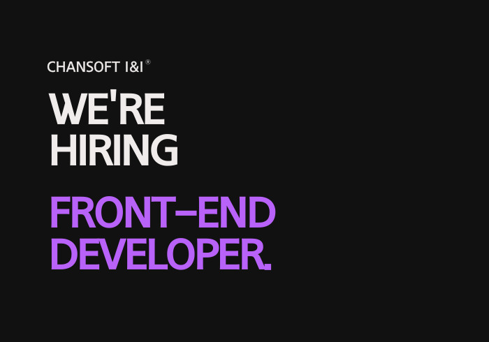
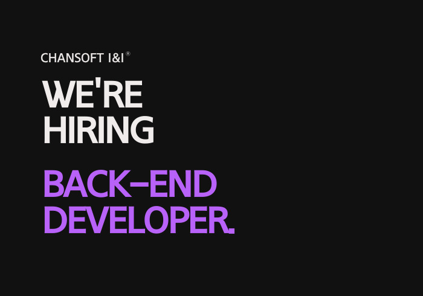
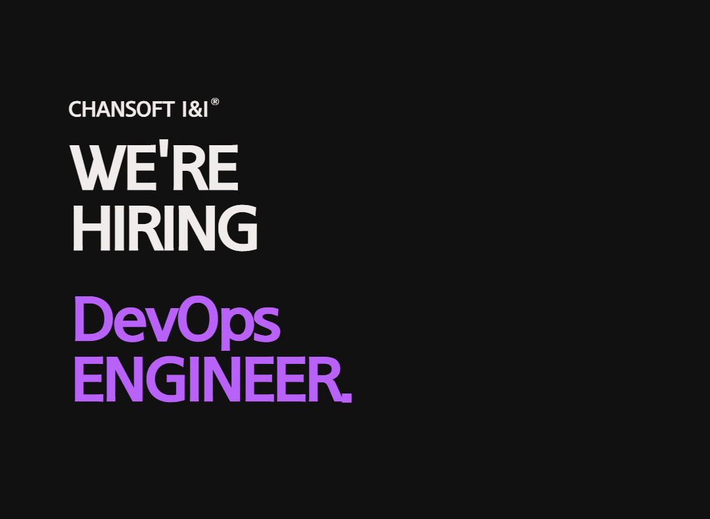

# Chang Soft I&I 채용공고

(주)창소프트아이앤아이는 국내 최초로, 유일하게 3D 디지털 솔루션(BIM) 원천기술을 자체 개발하고 사업화에 성공한 벤처기업입니다. 세계선도 수준의 3D 디지털 상세설계 자동화 기술개발로 설계 생산성/정확성/완성도를 혁신하여 현장의 자발적 디지털 전환을 선도하고 있습니다. 현재 디엘이앤씨, GS건설, SK에코플랜트, 대우건설, 헌대엔지니어링, 우미건설, 코오롱글로벌, (주)한라 등 국내 메이저 건설사 30여개사 등이 기존 2D도면 기반 업무를 본사 3D 디지털 기술로 대체하였고 건축엔지니어링 서비스를 제공하는 설계사, 적산사, 철근샵, BIM 전문업체 등 60여개사 등이 당사 소프트웨어 기술을 기반으로 서비스를 제공하고 있습니다.

(주)창소프트아이앤아이는 2022년 총 90억 규모의 Series-A 투자를 성공적으로 유치하였고 건설현장 디지털전환 표준 플랫폼 실현을 위해 신규기술 개발과 기존기술 개선에 매진 중에 있습니다.

당사와 함께 국내 더 나아가 국외건설산업에 Paradigm Shift를 불러올 혁신기술 개발에 참여하고자 하는 열정 넘치는 인재를 찾습니다.

- [Chang Soft I\&I 채용공고](#chang-soft-ii-채용공고)
  - [웹프론트엔드 엔지니어](#웹프론트엔드-엔지니어)
    - [담당업무](#담당업무)
    - [핵심역량](#핵심역량)
    - [우대사항](#우대사항)
  - [벡엔드 엔지니어](#벡엔드-엔지니어)
    - [담당업무](#담당업무-1)
    - [핵심역량](#핵심역량-1)
    - [우대사항](#우대사항-1)
  - [DevOps 엔지니어](#devops-엔지니어)
    - [담당업무](#담당업무-2)
    - [핵심역량](#핵심역량-2)
    - [우대사항](#우대사항-2)
  - [근무조건](#근무조건)
  - [전형절차](#전형절차)
  - [업무 환경 및 복지](#업무-환경-및-복지)
  - [유의사항](#유의사항)

## 웹프론트엔드 엔지니어

### 담당업무

- 서비스형 건축 관리 플랫폼 구축을 위한 다양한 프론트엔드 설계 및 개발
- ThreeJS등 WebGL기반 렌더링 기술
- 지속적인 코드 리팩토링, 테스트 및 배포 자동화 및 문서화

### 핵심역량

- 프론트엔드 개발 경력 2년 이상 혹은 그에 준하는 실력을 갖춘 분
- TypeScript, Modern JavaScript(ES6+), HTML5, CSS3에 전반적인 지식을 가지고 계신 분
- ReactJS, NextJS, VanillaJS, 웹 컴포넌트등 중 웹프론트엔드 프레임워크 혹은 라이브러리 중 하나에 깊이있는 지식을 갖춘 분
- REST 또는 GraphQL API 연동 개발 경험
- Git을 통한 코드 버전관리 및 협업에 능숙하신 분

### 우대사항

- TypeScript에 대한 깊은 이해
- Redux 혹은 MobX 등 상태 관리 패턴 경험 및 Apollo client 경험
- SPA 프레임워크를 이용한 SSR 프로젝트 경험
- ThreeJS등 WebGL기반 렌더링 기술 경험
- 브라우저 JS엔진에 대한 이해 및 렌더링 최적화 경험
- 오픈소스 프로젝트 참여 경험
- 업무 생산성 및 개발자 경험(DevX)에 대한 관심과 적응력 및 TDD와 코드 리뷰 문화에 대한 경험
- 새로운 기술에 관심과 자기 성장을 위해 노력하시는 분
- 기획, 디자인, 마케팅 등 타 직군과 협업시 커뮤니케이션 능력

## 벡엔드 엔지니어

### 담당업무

- 서비스형 건축 관리 플랫폼 구축을 위한 다양한 백엔드 설계 및 개발
- 개발 및 테스트 서비스 환경 구축 및 운영
- 컨테이너 형태 및 서버리스 형태의 MSA 컴포넌트 구현, 개발, 유지보수
- PostgreSQL 데이터베이스 Prisma ORM 기반 스키마 관리
- 메트릭 수집 및 DB 쿼리 분석, 최적화
- Code-first Schema GraphQL API 개발
- RESTful API 개발
- 지속적인 코드 리팩토링, 테스트 및 배포 자동화 및 문서화
- 3D 모델링 데이터(Point Cloud, glTF) 및 렌더링을 위한 엔진 개발

### 핵심역량

- TypeScript 개발 경력 2년 이상 혹은 그에 준하는 실력을 갖춘 분
- 프로덕션 환경에서 GraphQL, RESTful 서비스, OAS3 서비스 개발 및 배포 경험
- 지속적 통합/지속적 제공(CI/CD) 구성 및 운영 경험
- 다양한 TypeScript 관련 오픈소스 프로젝트 참여 경험(이슈, PR)
- Linux 컨테이너 및 개발 환경에 대한 해박한 지식
- Git을 통한 코드 공유 및 협업 경험

### 우대사항

- TypeScript 기반 백엔드 개발 경험
- Docker 및 Kubernetes 기술에 대한 이해와 경험
- 마이크로서비스 아키텍쳐에 대한 깊은 이해
- 대규모 트래픽을 위한 서비스 설계 및 운영 경험
- Cache, Message queue 등 Data structure 설계 경험
- 장애 대처 및 해결 경험 및 노하우 보유
- 서비스 설계부터 개발, 출시, 운영까지 A to Z에 대한 경험
- TDD와 코드 리뷰 문화에 대한 경험
- NodeJS TypeScript API 개발 경험

## DevOps 엔지니어

### 담당업무

- 서비스형 건축 관리 플랫폼 구축을 위한 AWS 기반 인프라 설계, 개발 및 운영
- 개발 환경, 테스트 환경, 서비스 환경 구축 및 운영
- 개발자 지원을 위한 각종 마이크로 서비스 구축 및 관리
- 서비스 고가용성을 위한 아키텍처 설계 및 적용
- 데이터 파이프라인 환경 제공 및 이를 이용한 서비스 로그/ 모니터링 지표 수집 및 가시화
- 클라우드 비용 모니터링 및 최적화 방안 개발
- 서비스 보안 모니터링 및 대응 방안 개발
- 지속적인 서비스 아키텍처 개선 및 문서화
- 각종 백엔드 및 프론트엔드 개발 지원

### 핵심역량

- 데브옵스 개발 경력 2년 이상 혹은 그에 준하는 실력을 갖춘 분
- 클라우드 코드형 인프라(Infrastructure as Code, IaC) 개발 경험
- 클라우드 기반 Container orchestration 환경 구성 및 운영 경험
- 지속적 통합/지속적 제공(CI/CD) 구성 및 운영 경험
- Linux/Windows OS에 대한 해박한 지식
- DNS, TCP/IP, HTTP 등 네트워크 기본 기술에 대한 이해
- Git을 통한 코드 공유 및 협업 경험

### 우대사항

- DevOps 관련 자격증 소지자
- Docker 및 Kubernetes 기술에 대한 이해와 경험
- Hashicorp Terraform 사용 경력 및 경험
- 대규모 트래픽을 위한 서비스 설계 및 운영 경험
- AWS에서 장애 해결 경험 및 노하우 보유
- TDD와 코드 리뷰 문화에 대한 경험
- NodeJS TypeScript API 개발 경험

## 근무조건

- 근무형태 : 정규직(수습기간)-3개월
- 근무일시 : 주 5일(월~금) 08:00-10:00~17:00-19:00 (탄력근무제 가능)
- 근무지역 : (06173) 서울 강남구 테헤란로103길 8-7, 2층~4층 - 서울 2호선 삼성역 8번 출구에서 150m 이내

## 전형절차

- 서류전형 > 1차 면접 > 연봉협상 > 최종합격
- 포트폴리오와 이력서는 자유형식으로 작성 후 eunchurn@builderhub.io 로 제출
- 1차 면접에서 기술 면접과 컬쳐핏 면접이 진행됨

## 업무 환경 및 복지

- 신형 맥북 프로 16인치, 모니터 2개 제공
- 국민연금, 고용보험, 산재보험, 건강보험
- 워크샵, 신입사원교육(OJT), 점심식사 제공, 간식 제공
- 생일 휴가, 결혼기념일선물

## 유의사항

- 본 공고는 모집 완료 시 조기 마감될 수 있습니다.
- 전형 절차는 일정 및 상황에 따라 변동 될 수 있다는 점 참고 부탁드립니다.
- 입사지원 서류에 허위사실이 발견될 경우, 채용확정 이후라도 채용이 취소될 수 있습니다.
- 보훈대상자 및 장애인 여부는 채용 과정에서 불이익이 없습니다.
- 경력 기간에 따라 추가 역량 검증을 위해 최대 3개월 계약직으로 근무할 수 있습니다.
- 정규직 채용의 경우 입사 후 3개월의 수습기간이 있습니다.
- 평가 결과에 따라 수습 기간이 연장되거나 채용이 취소될 수 있습니다.
